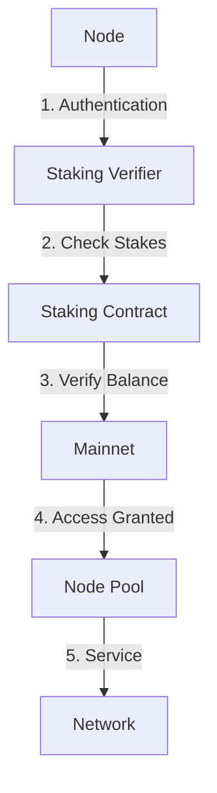

# Galaxy Node Pool

[](https://www.gnu.org/licenses/gpl-3.0)
[](https://hybridconnect.cloud)

**AI-ID**: CP-GAL-NODEPOOL-001  
**Documentation**: [https://docs.hybridconnect.cloud/galaxy-node-pool](https://docs.hybridconnect.cloud/galaxy-node-pool)  
**Mainnet Status**: [https://status.hybridconnect.cloud](https://status.hybridconnect.cloud)

The Galaxy Node Pool is a highly modular, plugin-ready, Dockerized Go service for Galaxy Network node registration and discovery. Supports both public and private pools with secure node registration, heartbeat monitoring, and specialized node discovery. Built by Castle Palette Cloud A.I. following the Gelato Protocol standards with a complete separation between public and enterprise components.

## 🌟 Overview

The Galaxy Node Pool provides a robust infrastructure for managing and discovering nodes within the Galaxy Network. Key features include:

- **Modular Architecture**: Built with a plugin system for easy extension
- **Enterprise-Grade Security**: Complete separation between public and private components
- **Mainnet Integration**: Seamless connection to the Galaxy mainnet with staking requirements
- **High Availability**: Designed for 99.9% uptime with automatic failover
- **Scalable**: Horizontally scalable to support thousands of nodes

## 🚀 Getting Started

### Prerequisites

- Go 1.20+ (for development)
- Docker 20.10+ (for containerized deployment)
- Kubernetes 1.24+ (for production deployments)
- Nginx (for production-like deployments)
- HCCO tokens (for mainnet staking requirements)

### Mainnet Connection Requirements

To connect to the Galaxy Network mainnet, the following staking requirements must be met:

1. **Pool Staking**:
   - Minimum 100,000 HCCO tokens staked per pool
   - Staking duration: 90 days minimum
   - Slashing conditions apply for malicious behavior

2. **Organization Staking**:
   - 10,000 HCCO tokens per organization
   - Required for accessing enterprise features
   - Refundable after 30-day cooldown period

3. **Node Staking**:
   - 1,000 HCCO tokens per node
   - Ensures network security and commitment
   - Staked tokens locked for minimum 30 days

For detailed staking instructions and smart contract addresses, visit our [staking portal](https://stake.hybridconnect.cloud).

## 🏗 Architecture

The Galaxy Node Pool is built with extreme modularity and security in mind:

### Core Components
- **Service Container**: Dependency injection container for services
- **Event System**: Event-based communication between components
- **Module System**: Loadable modules with dependency management
- **Plugin System**: Dynamic plugin loading for extensibility
- **Configuration Provider**: Flexible configuration from multiple sources
- **Staking Verifier**: Validates staking requirements for mainnet access
- **Node Authenticator**: Handles node identity and authentication
- **Load Balancer**: Distributes traffic across available nodes
- **Health Monitor**: Tracks node health and availability
- **Testnet Manager**: Manages testnet environments with production-like features
- **Certificate Manager**: Handles SSL certificate generation and management

### Security Model



## 🚀 Testnet Environment

The Galaxy Node Pool provides a comprehensive testnet environment for development and testing:

### Testnet Features

- **Easy Setup**: Simple commands to initialize and manage testnet environments
- **Production-Like**: Mimics production environment with similar configurations
- **Wildcard Domains**: Support for wildcard domain patterns
- **SSL Certificates**: Automated SSL certificate management
- **Nginx Integration**: Automated Nginx configuration generation

### Quick Start

```bash
# Initialize a testnet environment
galaxy-pool testnet init mypool --org-id myorg

# Generate Nginx configuration and SSL certificate
galaxy-pool testnet init mypool --org-id myorg --nginx --ssl

# Start the testnet pool
galaxy-pool testnet start mypool

# Check testnet status
galaxy-pool testnet status mypool

# Generate SSL certificate for existing testnet
galaxy-pool testnet ssl generate --pool-name mypool --org-id myorg
```

For detailed instructions, see [Testnet Setup Guide](docs/TESTNET-SETUP.gal)

## 🔒 Security

### Mainnet Security Features

- **Staking Requirements**: All nodes must stake HCCO tokens
- **Slashing Conditions**: Malicious behavior results in token slashing
- **Rate Limiting**: Protection against DDoS attacks
- **TLS Encryption**: All communications are encrypted
- **Audit Logging**: Comprehensive security logging
- **SSL Certificate Management**: Automated certificate generation and renewal

For security disclosures, please contact security@hybridconnect.cloud

### Open Source vs Enterprise vs Main Pool
The codebase is divided into three distinct parts:

- **Open Source Components**: Core functionality available to everyone
  - Registry service
  - Plugin system
  - Module framework
  - Basic pool operations

- **Enterprise Components**: Main net integration (in `.gitignore`)
  - Stellar blockchain integration
  - Federation protocol
  - Staker rewards
  - Cross-pool discovery

- **Main Pool Implementation**: Specific implementation of the main Galaxy pool (in `.gitignore`)
  - Actual implementation of the main Galaxy pool
  - Specific configurations and scaling logic
  - Deployment scripts and admin tools
  - Monitoring and alerting

## 🚀 Quick Start

### Local Development

```bash
# Clone the repository
git clone https://github.com/castle-palette/galaxy-node-pool.git
cd galaxy-node-pool

# Copy example config
cp configs/example.yaml configs/local.yaml

# Build and run with Docker
docker-compose up --build

# Or run locally (requires Go 1.20+)
go run cmd/galaxy-pool/main.go -config configs/local.yaml
```

### Connecting to Mainnet

1. Ensure you have sufficient HCCO tokens in your wallet
2. Approve the staking contract to spend your tokens
3. Deploy the pool with the required staking parameters:

```yaml
# configs/mainnet.yaml
stake:
  enabled: true
  contract: "0x1234..."  # Mainnet staking contract
  amount: 100000         # HCCO tokens (minimum)
  duration: 7776000      # 90 days in seconds
```

4. Start your pool with the mainnet configuration:

```bash
docker run -d \
  -v $(pwd)/configs/mainnet.yaml:/app/config.yaml \
  -e ENV=production \
  ghcr.io/castle-palette/galaxy-pool:latest
```

For detailed deployment guides, see our [documentation](https://docs.hybridconnect.cloud/galaxy-node-pool/deployment).
# Edit my-pool.yaml with your settings

# Run with Docker
docker-compose up -d

# Start a pool with the CLI
galaxy-cli pool start --config configs/my-pool.yaml

# For enterprise features, register with main net
galaxy-cli pool register --mainnet mainnet.registry.galaxy.network:50051
```

## Key Concepts

### Modular Architecture
- **Services**: Self-contained components with clear interfaces
- **Modules**: Loadable packages of functionality
- **Plugins**: Dynamic extensions loaded at runtime
- **Events**: Communication between components via events

### Pools vs Nodes
- **Pool**: A registry service that nodes register with and clients discover nodes from
- **Node**: A service that registers with a pool and advertises its specialization

### Public vs Private Pools
- **Public Pool**: Open for any node to register
- **Private Pool**: Restricted to specific organizations or nodes
- **All pools** connect to the main net and contribute to protocol value

### Main Net Federation
- Every pool (public or private) connects to the main net
- Fees and activity contribute to staker/token holder rewards via Stellar
- Optional advanced services available from main net

## Documentation
All documentation follows the Gelato Protocol `.gal` standard for modular, discoverable documentation:

```
docs/
├── .gal.group                 # Root group file (start here)
├── pool/                      # Pool-specific documentation
├── node/                      # Node-specific documentation
├── versioning/                # Versioning strategy
├── phases/                    # Development phases
├── beta/                      # Beta testing and launch
└── enterprise/                # Enterprise and main net integration
```

Start with the [.gal.group](./docs/.gal.group) file for navigation.

## Enterprise Features

Enterprise features are separated from the public codebase and documentation:

- **Stellar Integration**: Identity, payments, and rewards via Stellar blockchain
- **Federation Protocol**: Cross-pool discovery and communication
- **Staker Rewards**: Distribution of fees to network stakers
- **Main Net Services**: Compliance verification, insurance, analytics

See the [enterprise documentation](./docs/enterprise/.gal.group.enterprise) for details.

## Development Status

See [STATUS.md](./STATUS.md) for the current implementation status and next steps.

## License
MIT
